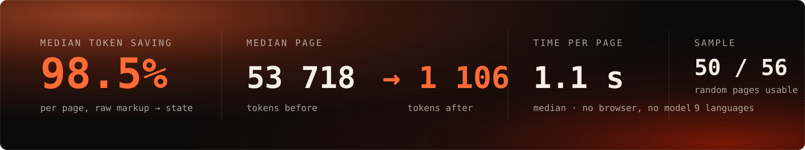
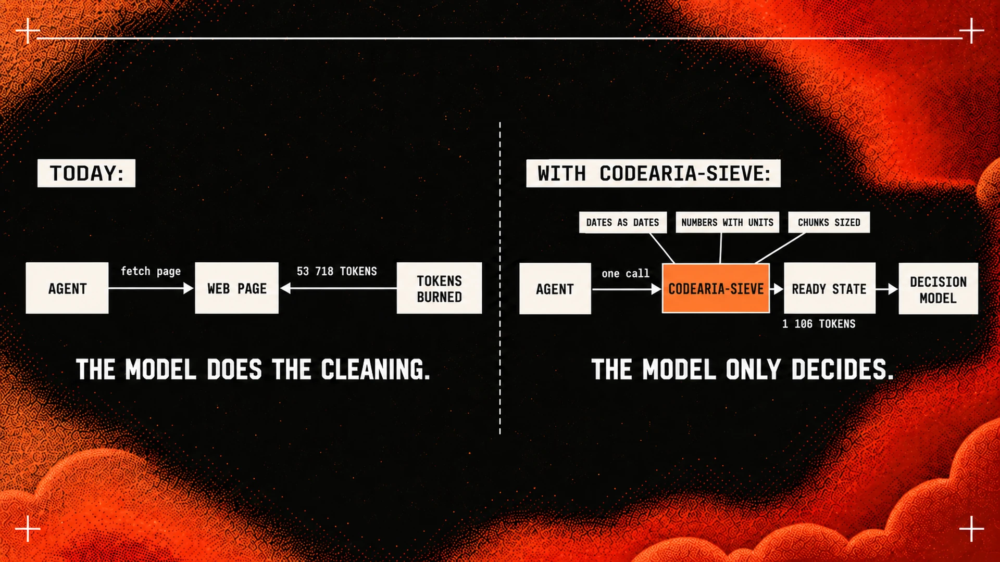
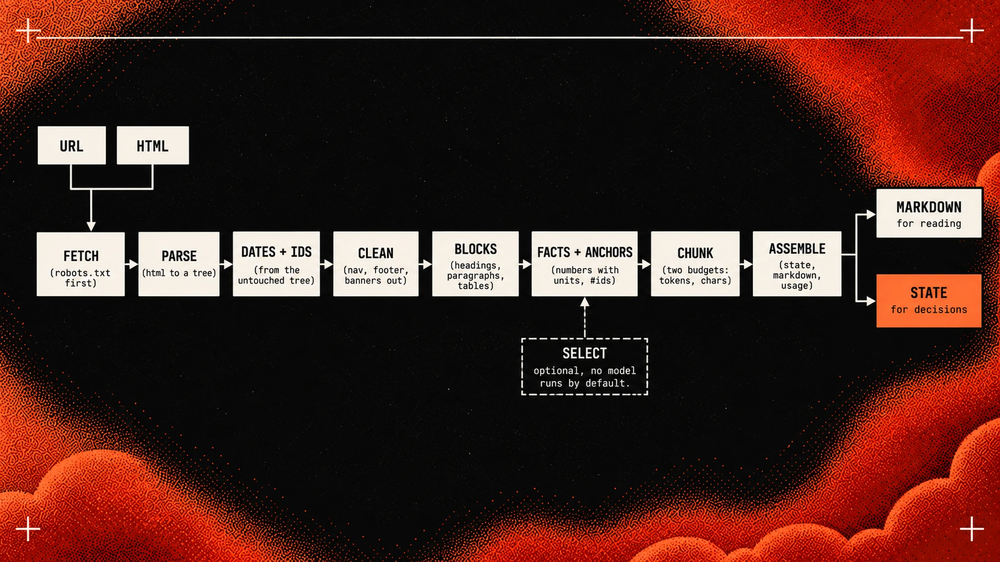
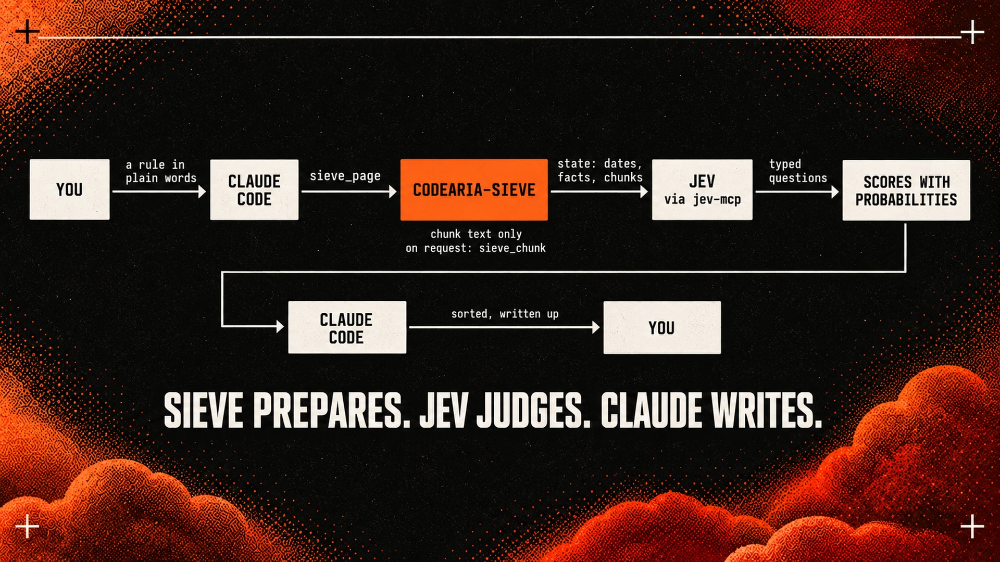

<p align="center">
  
</p>

<h1 align="center">codearia-sieve</h1>

<p align="center">
  <strong>Parses a web page into the exact format a decision model needs.</strong><br>
  Dates as dates. Numbers with units. Text in chunks that fit the model's window, each pointing back to where it came from.<br>
  One call — and the token bill, before and after.
</p>

<p align="center">
  <a href="#use-it-from-an-agent"></a>
  <a href="#use-it-as-a-library"></a>
  <a href="https://www.npmjs.com/package/codearia-sieve"></a>
  <a href="LICENSE"></a>
  
  
</p>

```sh
npx codearia-sieve          # MCP server for Claude Code, Cursor and any agent
npm i codearia-sieve        # or the library
```

<br>

<p align="center">
  
</p>

<p align="center"><sub><strong>Measured, not promised.</strong> The numbers come from a live run over 56 random pages on 21 September 2026 — fresh news from nine RSS feeds in seven languages, random Wikipedia articles, docs, blogs, government sites, recipes, shops. Every row is in <a href="bench/analytics/">bench/analytics/</a>, and <code>npm run analytics</code> reruns the whole thing. The output was then put in front of a decision model: see <a href="#checked-by-a-judge">Checked by a judge</a>.</sub></p>

<br>

## What it does

An agent that needs a web page fetches the whole thing: navigation, cookie banner, footer, ad slots, a megabyte of framework markup. Then a model paid per token digs through the pile for one paragraph.

**codearia-sieve does the digging before the model sees anything** — and returns the page as *state*, not prose:

<table>
<tr>
<td width="33%" valign="top">

**Dates become dates**

`"Published September 15, 2026"` → `"2026-09-15"`.
Read from JSON-LD, meta tags and `<time>` first; from a byline only when the markup is silent, and never guessed.

</td>
<td width="33%" valign="top">

**Numbers become facts**

`"$42 per billion tokens"` → `{ value: 42, unit: "USD_per_billion" }`.
Works in nine languages; the decimal comma follows the page's language. A number without a unit is not a fact. A year is never a fact.

</td>
<td width="33%" valign="top">

**Text becomes chunks that fit**

Each chunk knows its size in tokens and characters, the blocks it was built from, and the `#anchor` on the page where a decision can be checked.

</td>
</tr>
</table>

Everything else — menus, footers, banners, tag rows, "read more" — is removed, and with `trace: true` you get the list of what was removed and why.

<br>

<p align="center">
  
</p>

## Who it is for

**People who build agents and have seen the bill.** Every fetched page costs tens of thousands of tokens before the agent has read a word of it. Median page in the sample: 53 718 tokens in, 1 106 out.

**People who run cheap decision models.** Classifiers, rankers, System One models like [Jev](https://docs.typesafe.ai/models) that judge instead of write. They are nearly free and very fast, and they have hard edges: they cannot count, they read dates as text, and their accuracy drops as irrelevant material fills the context. Every "page to markdown" tool prepares input for a reader. This one prepares input for a judge.

**People who need answers they can check.** A verdict from scraped text is unprovable unless each piece points back to its source. Here every fact names its block and every chunk carries an anchor.

<br>

<p align="center">
  
</p>

## How it works

Eight steps of ordinary code. No model runs unless you plug one in. The same HTML gives the same JSON, byte for byte.

1. **Fetch** — `robots.txt` first; a refusal is reported, not bypassed. Plain HTTP, honest user agent.
2. **Parse** — HTML into a DOM with `linkedom`. No browser.
3. **Dates and ids from the untouched tree** — cleaning strips `<head>`, bylines and attributes, so both are read before it runs.
4. **Clean** — Defuddle removes chrome; Readability takes over if it comes back empty. Inline elements get a space first, so `<span>20 Sept</span><span>10 min</span>` never becomes `202610 min`.
5. **Blocks** — headings, paragraphs, lists, tables, code, quotes, in order, with positional ids. Old pages set with `<br><br>` become paragraphs too; table rows keep their column headers.
6. **Facts and anchors** — ids restored; numbers become facts only beside a unit; ranges keep both ends.
7. **Chunk** — greedy, in order, under two budgets at once: 20 000 tokens and 50 000 characters by default.
8. **Assemble** — `state`, `markdown`, `usage`, `warnings`, and the trace on request.

<details>
<summary><strong>What the result looks like</strong></summary>

```ts
const r = await sieve({ kind: 'url', url: 'https://docs.typesafe.ai/models' });

r.state.title         // "Models"
r.state.facts[0]      // { value: 42, unit: "USD_per_billion", label: "price_btok_mtok",
                      //   context: "Price (per Btok / per Mtok) | jev-1.13.0: $42 / $0.042", from: "b3" }
r.state.facts[1]      // { value: 0.042, unit: "USD_per_million", … }   — paired by position
r.state.chunks[0]     // { id: "c1", tokens: 1210, chars: 5357, anchor: "Current models",
                      //   blocks: ["b1", …, "b36"], text: "…" }
r.usage               // { rawTokens: 127413, stateTokens: 1211,
                      //   visibleChars: 4939, stateChars: 5357, chunks: 1, ms: 1503 }
r.warnings            // []
r.markdown            // the same article, for a human or a generative model
```

Expected outcomes never throw. They come back as warnings, each named:

| Warning | Meaning |
|---|---|
| `robots-disallowed` | the site asks crawlers to stay out; we did not fetch |
| `blocked` | a bot challenge or a refusal (403, 405, 429, "Just a moment…"), with the status |
| `paywall` | the page marks its article as not free; you got the teaser |
| `empty-without-js` | the article container is empty and a script would fill it |
| `thin-content` | a big page that yielded little prose — a front page, a listing |
| `block-split` | one block exceeded the budget and was cut on sentence boundaries |

</details>

<br>

<p align="center">
  
</p>

## Use it from an agent

You say what you want in plain words. The agent finds the pages, calls `sieve_page` for each, hands the state to a decision model with a typed question, and writes up the result. **Sieve prepares. The judge judges. The agent writes.**

```json
{ "mcpServers": { "sieve": { "command": "npx", "args": ["-y", "codearia-sieve"] } } }
```

<table>
<tr>
<td width="50%" valign="top">

**`sieve_page`** — `url` or `html`

Returns typed `structuredContent` with an output schema: `source`, `state`, `usage`, `warnings`. In the default `summary` mode chunks carry sizes and anchors but **no text** — the agent sees what exists without paying for it. `mode: "full"` and `mode: "markdown"` when you want everything.

</td>
<td width="50%" valign="top">

**`sieve_chunk`** — `url`, `id`

The text of one chunk from the last result for that URL, no refetch. Overview first, then only what is needed — the tool applies its own idea to itself.

</td>
</tr>
</table>

Pairs with [`jev-mcp`](https://github.com/jkudish/jev-mcp): chunks are sized to fit its fields, so state goes straight into a typed question.

## Checked by a judge

The claim is that a decision model gets *better* input from Sieve than from raw text. So the output was handed to one. [`examples/jev.ts`](examples/jev.ts) drives both MCP servers with the official client — `codearia-sieve` prepares six pages (API docs, a release note, two Wikipedia articles in two languages, two pricing pages), [Jev](https://docs.typesafe.ai/models) judges them through `jev-mcp`. Same run, 21 September 2026:

| Question to Jev | Input from Sieve | Result |
|---|---|---|
| `jev_classify` — what kind of page is this? | title + head of the first chunk, under the tool's 2 000-char limit | 6 of 6 correct; 5 auto, 1 flagged for review — a page that is both docs and a rate card |
| `jev_verify` — is each extracted fact really on the page? | every fact as a claim, its chunks as evidence | **11 of 11 verified, all auto**, confidence 0.86–1.0 |
| `jev_extract` — when was it published? | first chunk, a date regex, a description | agrees with Sieve where the page states a date; Sieve also reads JSON-LD and `<meta>`, which Jev never sees |

The first pass of this test did its job the other way round: Jev sent three facts to review and contradicted one. All four traced to Sieve — a table row labelled by its column header instead of its row header, two rates in one header left unpaired, and a Russian bibliographic "256 с." read as seconds. Fixed, tested, rerun: 11 of 11. A judge that can tell you when your parser is wrong is the point of the whole pairing.

```sh
TYPESAFE_API_KEY=… node --experimental-strip-types examples/jev.ts
```

## Use it as a library

```ts
import { sieve } from 'codearia-sieve';

await sieve({ kind: 'url', url });                    // fetch it
await sieve({ kind: 'html', html, url });             // already have it; url only for anchors

await sieve(input, {
  budget:    { maxTokens: 8000, maxChars: 30000 },    // chunk limits
  trace:     true,                                    // everything discarded, and why
  tokenizer: myTokenizer,                             // o200k by default; swap for your model's
  fetcher:   myFetcher,                               // your transport, or a file reader in tests
  now:       () => fixedDate,                         // injected clock: identical output on identical input
  selector:  mySelector, task: 'is this about pricing?', // relevance judge; nothing runs without one
});
```

`parseDate`, `findDates` and the vendor limits (`JEV`, `JEV_MCP`, `DEFAULT_BUDGET`) are exported too.

## Where it stops

- **Front pages, listings and product pages** have no article to find. You get the headlines and a `thin-content` warning, not a fake win.
- **Articles rendered by JavaScript** come back as `empty-without-js` when the container is empty. A site that ships a teaser and streams the rest cannot be told apart without a browser; you get the teaser.
- **Text-heavy pages save less.** A whole novel saves 22 %, an RFC 84 %: there is no wrapping to remove and the text is kept in full. That is the tool working.
- **A pricing grid is not a table.** A fact knows the block it came from, not the plan column it sits under; Sieve does not guess the pairing. Send the chunk — a pricing page is about a thousand tokens after cleaning — and let the judge read it: [`examples/pricing-watch.ts`](examples/pricing-watch.ts).
- **Tokens are counted with o200k** as an approximation. Pages over a megabyte get a sampled count and `usage.rawTokensEstimated: true`.

## Develop

```sh
npm install
npm test                    # 50 tests, offline, about a second
npm run demo -- <url>       # the token bill for one page
npm run bench               # the 20-page benchmark set
npm run analytics           # the 56-page random sample: rows, CSV, summary
```

Design notes — [vision](docs/01-vision.md) and [architecture](docs/02-architecture.md) — are in [`docs/`](docs/).

<p align="center"><sub>MIT © 2026 Anton Evelson · <a href="https://academy.codearia.com/">Codearia Academy</a></sub></p>
