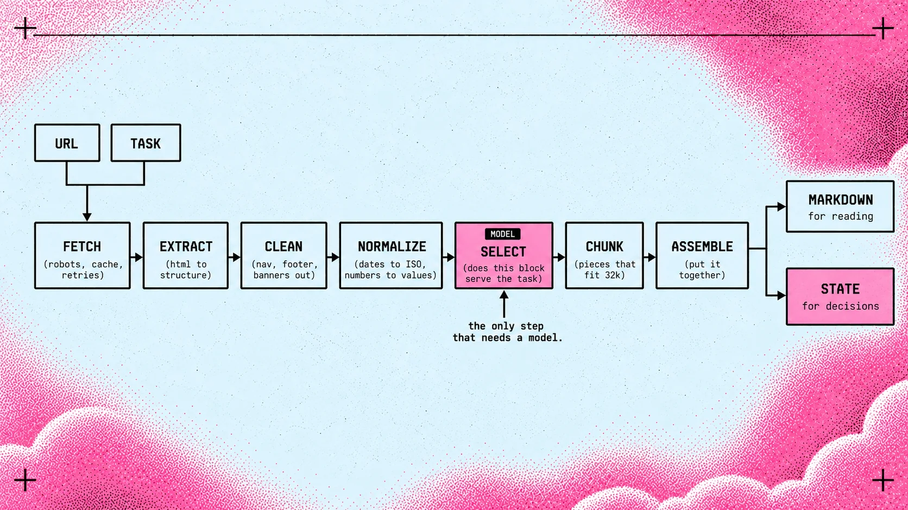
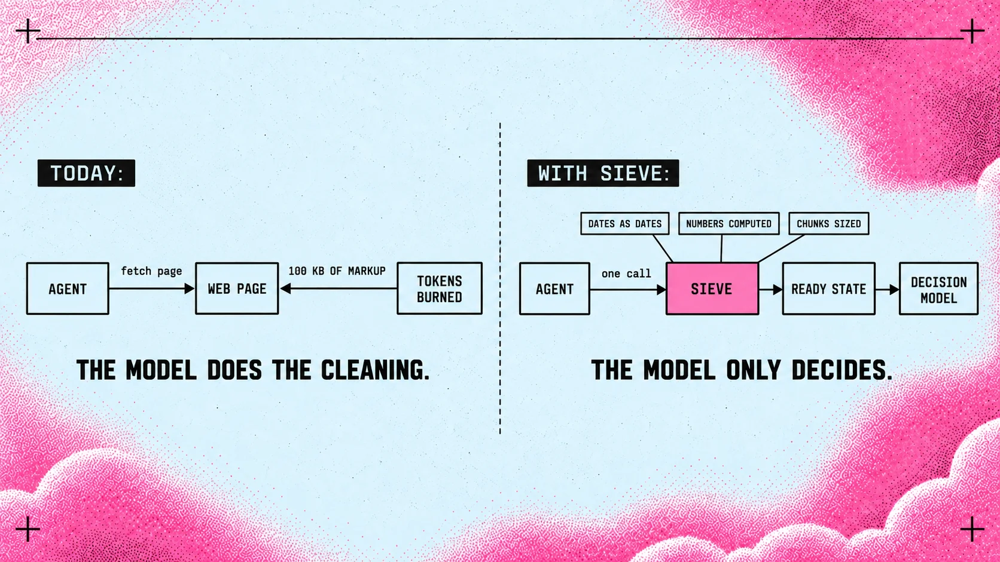

# Sieve. Видение

*Рабочее имя. Сито пропускает нужное и задерживает всё остальное — это
ровно то, что делает инструмент.*

---

## Мысль, с которой всё начинается

Сегодня, когда агенту нужна страница из интернета, он идёт туда сам. Скачивает
сто килобайт разметки, меню, баннеры согласия, футер с копирайтом и три
рекламных блока. Потом честно платит за всё это токенами и пытается найти в
этой куче тот единственный абзац, ради которого шёл.

Это устроено задом наперёд. Модель, которая стоит дорого за каждую тысячу
токенов, занимается работой уборщика: отделяет содержимое от обёртки.

Идея простая: **вынести эту работу наружу**. Есть сервис, к которому агент
приходит по API со своим ключом и задачей, а получает не страницу, а готовый
материал. Чистый, размеченный, ровно той формы, которая нужна тому, кто
спрашивает.

## Что изменилось в сентябре 2026

Пятнадцатого сентября вышел Jev, первая публичная System One модель. Она не
пишет текст вообще: принимает состояние и типизированные вопросы, возвращает
решения с вероятностями. Стоит четыре цента за миллион входных токенов и
отвечает за доли секунды.

И у неё есть особенности, которые меняют всё для нашей темы. У Jev тридцать
две тысячи токенов на состояние. Точность падает, когда в состоянии лежит
лишнее — авторы называют это context rot и пишут об этом сами. Он не считает.
Он читает даты как текст, а не как упорядоченные величины.

Иначе говоря: **самой быстрой и дешёвой модели решений нужен самый
аккуратный вход**. Свалить ей страницу целиком нельзя. Отдать ей markdown,
сделанный для человеческого чтения, тоже нельзя: там останутся даты строками,
числа прозой и три абзаца, которых вопрос не касается.

Никто сегодня не готовит контекст под это. Все существующие сервисы вида
«страница в markdown» решают задачу «сделать читаемо». Задача «сделать
решаемо» — свободна.

## Как это выглядит

*Семь шагов от адреса до состояния. Модель нужна ровно на одном из них.*

*Слева то, как агент работает сейчас. Справа то, ради чего всё затевается.*

## Что делает Sieve

Приходит запрос: вот ресурсы, вот задача. Сервис уходит, забирает страницы и
возвращает не текст, а **состояние, готовое к вопросам**.

Это значит:

- обёртка снята, остался материал;
- даты вынуты из прозы в отдельные поля, уже как даты;
- числа посчитаны и приведены к единицам, а не оставлены строками;
- материал нарезан на куски, каждый из которых помещается в бюджет модели;
- к каждому куску приложено, откуда он взят, чтобы ответ можно было
  проверить;
- всё, что к задаче не относится, выброшено, а не «оставлено на всякий
  случай».

Агент получает ответ и сразу задаёт вопросы. Не тратит свои токены на
разбор, не платит генеративную цену за уборку, не рискует точностью из-за
мусора в контексте.

## Две формы одного продукта

**Markdown для чтения.** Классический режим: страница превращается в чистый
MD-файл. Это то, что нужно генеративной модели и человеку.

**State для решений.** Наш собственный режим: тот же материал, но собранный
под System One. Поля вместо прозы, куски по бюджету, посчитанные величины,
ссылки на источник.

Первое делают многие. Второе не делает никто, и именно оно становится нужно
ровно сейчас, когда решения уходят из больших моделей в отдельный класс.

## Кому это нужно

Тому, кто строит агентов и уже посчитал свой счёт. Тому, кто гоняет
классификацию по чужим страницам: мониторинг конкурентов, скоринг лидов,
проверка фактов, SEO и GEO-аудит. Тому, кто хочет отдать решения дешёвой
модели, но каждый раз спотыкается о подготовку данных для неё.

Отдельно: нам самим. У нас есть академия, есть инструменты в мастерской, есть
планы на публичный аудит страниц. Sieve — это слой, на котором всё это стоит.
Мы будем его первым и самым требовательным пользователем, и это лучшая
проверка, какая бывает.

## Как он продаётся

Ключ и подписка. Не «оплата за токены, разберитесь сами», а понятные планы по
числу страниц и объёму. Бесплатный уровень, на котором можно попробовать без
карты, потому что инструмент для разработчиков продаётся только так.

Открытый исходник ядра — разбор страницы, нормализация, нарезка — и платный
хостинг с ключами, лимитами и наблюдаемостью. Ядро в открытом виде приводит
тех, кто иначе никогда бы не узнал о сервисе, а хостинг оплачивает работу.
Решение о том, что именно открывается, принимается до первой строчки кода:
переигрывать это потом дорого и некрасиво.

## Во что это вырастает

Сначала один эндпойнт: дай страницу, получи state.

Потом задача вместо адреса: «собери всё про вот эту компанию с вот этих
источников и приготовь к вопросам». Сервис сам обходит, сам решает, что
относится к делу, и возвращает готовое.

Потом подписка на изменения: следить за страницами и присылать не «страница
изменилась», а «вот что изменилось по сути, вот новое состояние».

И в какой-то момент это перестаёт быть парсером. Это становится слоем между
интернетом и агентами: местом, где сырое превращается в пригодное для
решений.

---

## Одной фразой

Модели научились решать дёшево. Осталось научиться так же дёшево готовить
для них материал. Sieve — про это.
